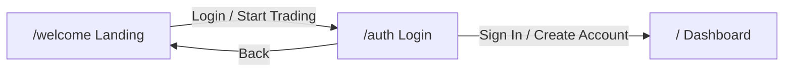

# Live Demo Enhancements Plan

## 1. Landing page in the flow

**Routing**

- In [src/App.tsx](src/App.tsx): Add a **public** route for the landing page so the funnel is reachable:
  - Add `path="/welcome"` with `element={<Index />}` (import `Index` from `./pages/Index.tsx`).
  - Keep `path="/"` as `DashboardHome` inside `DashboardLayout` (dashboard remains the app root after "login").

**Landing CTAs**

- In [src/components/landing/Navbar.tsx](src/components/landing/Navbar.tsx):
  - Change the logo `Link to="/"` to `Link to="/welcome"` so from the landing, logo stays on landing.
  - Change "Start Trading" from `Link to="/dashboard"` to `Link to="/auth"` (there is no `/dashboard` route; flow is welcome → auth → dashboard at `/`).
- No change needed in [src/components/landing/Hero.tsx](src/components/landing/Hero.tsx): "Start Trading" already goes to `/dashboard` — update to `/auth` for consistency, or to `/` if you prefer one-click into app; recommend `/auth` for the full demo story.

**Auth flow**

- In [src/pages/Auth.tsx](src/pages/Auth.tsx):
  - Change the "Dashboard" back link from `Link to="/"` to `Link to="/welcome"` so Back from auth returns to the landing page.
  - Keep the submit button navigating to `/` (dashboard). Replace the current `<Button asChild><Link to="/">` with a real submit handler: on form submit (or button click), call `localStorage.setItem("nova-demo-auth", "true")`, then `navigate("/")` (use `useNavigate()` from react-router-dom). This gives a clear "logged in for demo" state and a single place to enter the app.

**Resulting flow**

---

## 2. Demo-mode indicator

- In [src/layouts/DashboardLayout.tsx](src/layouts/DashboardLayout.tsx), in the top header (same row as search, theme toggle, wallet pill):
  - Add a small, non-intrusive label so the demo is clearly simulated, e.g. a pill/badge: **"Demo – simulated data"** or **"Demo mode"**.
  - Use existing design tokens (e.g. `text-muted-foreground`, `bg-muted/50`, or a soft primary tint) and keep it compact so it does not dominate the UI. Only visible when the user is inside the dashboard layout.

---

## 3. Toasts on key actions

**Trading Terminal** — [src/components/dashboard/TradingTerminal.tsx](src/components/dashboard/TradingTerminal.tsx)

- Import `toast` from `sonner`.
- On the primary order button ("Buy BTC" / "Sell BTC" around lines 171–176): add `onClick` that calls `toast("Order placed (demo)")` (or "Buy order placed (demo)" / "Sell order placed (demo)" based on `side`). Optionally (see section 5) also append a demo trade to local state.

**Copy Trading** — [src/components/dashboard/CopyTrading.tsx](src/components/dashboard/CopyTrading.tsx)

- Import `toast` from `sonner`.
- On "Start Copying" button (around line 156): add `onClick` that shows a toast, e.g. `toast("Now copying " + selectedTrader?.name)` (guard for `selectedTrader`), then call `setShowModal(false)` to close the modal.

**Wallet** — [src/pages/Wallet.tsx](src/pages/Wallet.tsx)

- Replace existing toasts with demo-friendly messages:
  - Deposit: `toast("Deposit requested (demo)")` (and optionally trigger optimistic balance update; see section 5).
  - Withdraw: `toast("Withdrawal requested (demo)")`.
  - Transfer: `toast("Transfer requested (demo)")`.

**Bot Trading** — [src/components/dashboard/BotTrading.tsx](src/components/dashboard/BotTrading.tsx)

- Import `toast` from `sonner`.
- On "Deploy Bot" button (around line 237): add `onClick` that calls `toast("Bot deployed (demo)")` and `setShowConfig(false)` to close the config panel.

---

## 4. Auth "login" persistence (demo)

- In [src/pages/Auth.tsx](src/pages/Auth.tsx):
  - On successful "login" or "create account" (when navigating to dashboard): set a flag in localStorage, e.g. `localStorage.setItem("nova-demo-auth", "true")`, before calling `navigate("/")`.
  - No need to read this flag elsewhere for the minimal demo (the dashboard is always accessible); this keeps the option to later gate dashboard routes on "demo logged in" or show a different state.

---

## 5. Optional "wow" moments (optimistic updates)

**Wallet — optimistic balance**

- In [src/pages/Wallet.tsx](src/pages/Wallet.tsx):
  - Add local state for the displayed total balance, e.g. `const [displayBalance, setDisplayBalance] = useState(walletData.totalBalance)`.
  - Render the main "Total Balance" value from `displayBalance` instead of `walletData.totalBalance`.
  - On **Deposit** button click: after the toast, run `setDisplayBalance(prev => prev + 5000)` (or another fixed demo amount) so the balance visibly increases for the rest of the session. Leave Withdraw/Transfer as toasts only unless you want symmetric optimistic updates.

**Trading Terminal — demo trade in history**

- In [src/components/dashboard/TradingTerminal.tsx](src/components/dashboard/TradingTerminal.tsx):
  - Add state for extra demo trades, e.g. `const [demoTrades, setDemoTrades] = useState<Array<{ id: number; pair: string; side: string; price: number; amount: number; total: number; time: string; status: string }>>([])`.
  - On the "Buy BTC" / "Sell BTC" button click (same place as the toast): append one item to `demoTrades` with a structure matching `tradeHistory` (e.g. pair `"BTC/USDT"`, side from `side`, price from current chart/mock, amount/total from slider or fixed demo values, `time: "Just now"`, `status: "Filled"`).
  - In the Trade History table, render `[...tradeHistory, ...demoTrades]` so the new row appears immediately under the existing list.

---

## File change summary

| File                                                                                         | Changes                                                                                                   |
| -------------------------------------------------------------------------------------------- | --------------------------------------------------------------------------------------------------------- |
| [src/App.tsx](src/App.tsx)                                                                   | Import Index; add route `path="/welcome"` with `element={<Index />}`.                                     |
| [src/pages/Auth.tsx](src/pages/Auth.tsx)                                                     | Back link to `/welcome`; form/button submit: set `nova-demo-auth` in localStorage, then `navigate("/")`.  |
| [src/components/landing/Navbar.tsx](src/components/landing/Navbar.tsx)                       | Logo `to="/welcome"`; "Start Trading" `to="/auth"`.                                                       |
| [src/components/landing/Hero.tsx](src/components/landing/Hero.tsx)                           | "Start Trading" link: change to `/auth` (and optionally "Watch Demo" to `/` if desired).                  |
| [src/layouts/DashboardLayout.tsx](src/layouts/DashboardLayout.tsx)                           | Add "Demo – simulated data" pill/badge in header.                                                         |
| [src/components/dashboard/TradingTerminal.tsx](src/components/dashboard/TradingTerminal.tsx) | Import toast; order button onClick: toast + optional `demoTrades` state and append one row to history.    |
| [src/components/dashboard/CopyTrading.tsx](src/components/dashboard/CopyTrading.tsx)         | Import toast; "Start Copying" onClick: toast with trader name, `setShowModal(false)`.                     |
| [src/pages/Wallet.tsx](src/pages/Wallet.tsx)                                                 | Update Deposit/Withdraw/Transfer toasts; optional `displayBalance` state and optimistic +5000 on Deposit. |
| [src/components/dashboard/BotTrading.tsx](src/components/dashboard/BotTrading.tsx)           | Import toast; "Deploy Bot" onClick: toast, `setShowConfig(false)`.                                        |

---

## Implementation order

1. Routes and landing links (App, Navbar, Hero, Auth back link and submit handler).
2. Demo indicator in DashboardLayout.
3. Toasts in Terminal, CopyTrading, Wallet, BotTrading.
4. Optimistic Wallet balance and Terminal trade history (optional but recommended for the "wow" effect).

No backend or API changes; all behavior is client-side with existing mock data and localStorage for demo auth.